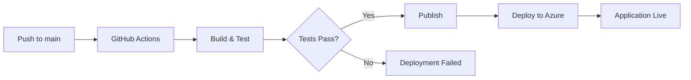

# 🚀 Azure Deployment Guide - FinanceSap.Enterprise

## 📋 Prerequisites

- Azure Account with active subscription
- Azure CLI installed (`az --version`)
- GitHub repository with the code
- MySQL database on Azure (Azure Database for MySQL Flexible Server)

---

## 1️⃣ AZURE RESOURCES SETUP

### Create Resource Group
```bash
az group create \
  --name rg-financesap \
  --location eastus
```

### Create Azure Database for MySQL
```bash
az mysql flexible-server create \
  --resource-group rg-financesap \
  --name financesap-mysql \
  --location eastus \
  --admin-user dbadmin \
  --admin-password <YourSecurePassword> \
  --sku-name Standard_B1ms \
  --tier Burstable \
  --storage-size 32 \
  --version 8.0.21
```

### Create Azure Web App
```bash
az appservice plan create \
  --name asp-financesap \
  --resource-group rg-financesap \
  --sku B1 \
  --is-linux

az webapp create \
  --resource-group rg-financesap \
  --plan asp-financesap \
  --name financesap-api \
  --runtime "DOTNET|9.0"
```

---

## 2️⃣ DATABASE SETUP

### Option A: Using Azure Portal
1. Navigate to your MySQL server in Azure Portal
2. Go to **Databases** → **Add**
3. Create database: `financesap_db`
4. Go to **Query editor**
5. Copy and paste the entire content of `database-schema.sql`
6. Execute the script

### Option B: Using MySQL Workbench
```bash
# Get connection string from Azure Portal
mysql -h financesap-mysql.mysql.database.azure.com \
      -u dbadmin \
      -p \
      financesap_db < database-schema.sql
```

### Verify Database
```sql
-- Check all tables
SHOW TABLES;

-- Verify migration history
SELECT * FROM __EFMigrationsHistory;

-- Check table structures
DESCRIBE customers;
DESCRIBE loans;
DESCRIBE accounts;
```

---

## 3️⃣ ENVIRONMENT VARIABLES CONFIGURATION

### Set Connection String in Azure Web App
```bash
# Build connection string
CONNECTION_STRING="Server=financesap-mysql.mysql.database.azure.com;Database=financesap_db;User=dbadmin;Password=<YourPassword>;SslMode=Required;"

# Set environment variable
az webapp config appsettings set \
  --resource-group rg-financesap \
  --name financesap-api \
  --settings MYSQL_CONNECTION_STRING="$CONNECTION_STRING"
```

### Set JWT Configuration
```bash
az webapp config appsettings set \
  --resource-group rg-financesap \
  --name financesap-api \
  --settings \
    Jwt__Key="<YourSecureJwtKey-MinimumLength32Characters>" \
    Jwt__Issuer="FinanceSap" \
    Jwt__Audience="FinanceSap"
```

### Set ASPNETCORE Environment
```bash
az webapp config appsettings set \
  --resource-group rg-financesap \
  --name financesap-api \
  --settings ASPNETCORE_ENVIRONMENT="Production"
```

---

## 4️⃣ GITHUB ACTIONS SETUP

### Get Publish Profile
```bash
az webapp deployment list-publishing-profiles \
  --resource-group rg-financesap \
  --name financesap-api \
  --xml
```

### Add GitHub Secret
1. Go to your GitHub repository
2. Navigate to **Settings** → **Secrets and variables** → **Actions**
3. Click **New repository secret**
4. Name: `AZURE_WEBAPP_PUBLISH_PROFILE`
5. Value: Paste the entire XML content from the previous command
6. Click **Add secret**

### Update Workflow File
The workflow file `.github/workflows/main_financesap.yml` is already configured.
Just update the `AZURE_WEBAPP_NAME` if you used a different name:

```yaml
env:
  AZURE_WEBAPP_NAME: financesap-api  # Change this if needed
```

---

## 5️⃣ FIREWALL CONFIGURATION

### Allow Azure Services
```bash
az mysql flexible-server firewall-rule create \
  --resource-group rg-financesap \
  --name financesap-mysql \
  --rule-name AllowAzureServices \
  --start-ip-address 0.0.0.0 \
  --end-ip-address 0.0.0.0
```

### Allow Your IP (for management)
```bash
MY_IP=$(curl -s https://api.ipify.org)

az mysql flexible-server firewall-rule create \
  --resource-group rg-financesap \
  --name financesap-mysql \
  --rule-name AllowMyIP \
  --start-ip-address $MY_IP \
  --end-ip-address $MY_IP
```

---

## 6️⃣ DEPLOYMENT

### Manual Deployment (First Time)
```bash
# Build and publish locally
dotnet publish FinanceSap.Api/FinanceSap.Api.csproj \
  --configuration Release \
  --output ./publish

# Create zip file
cd publish
zip -r ../app.zip .
cd ..

# Deploy to Azure
az webapp deployment source config-zip \
  --resource-group rg-financesap \
  --name financesap-api \
  --src app.zip
```

### Automatic Deployment (GitHub Actions)
1. Push code to `main` branch
2. GitHub Actions will automatically:
   - Restore dependencies
   - Build the application
   - Run all tests
   - Deploy to Azure (if tests pass)

---

## 7️⃣ VERIFICATION

### Check Application Status
```bash
az webapp show \
  --resource-group rg-financesap \
  --name financesap-api \
  --query state
```

### View Application Logs
```bash
az webapp log tail \
  --resource-group rg-financesap \
  --name financesap-api
```

### Test API Endpoints
```bash
# Get the app URL
APP_URL=$(az webapp show \
  --resource-group rg-financesap \
  --name financesap-api \
  --query defaultHostName \
  --output tsv)

# Test health endpoint (if you have one)
curl https://$APP_URL/health

# Test Scalar documentation
curl https://$APP_URL/scalar/v1
```

---

## 8️⃣ MONITORING & DIAGNOSTICS

### Enable Application Insights
```bash
az monitor app-insights component create \
  --app financesap-insights \
  --location eastus \
  --resource-group rg-financesap

# Get instrumentation key
INSTRUMENTATION_KEY=$(az monitor app-insights component show \
  --app financesap-insights \
  --resource-group rg-financesap \
  --query instrumentationKey \
  --output tsv)

# Configure Web App
az webapp config appsettings set \
  --resource-group rg-financesap \
  --name financesap-api \
  --settings APPINSIGHTS_INSTRUMENTATIONKEY="$INSTRUMENTATION_KEY"
```

### Enable Diagnostic Logs
```bash
az webapp log config \
  --resource-group rg-financesap \
  --name financesap-api \
  --application-logging filesystem \
  --detailed-error-messages true \
  --failed-request-tracing true \
  --web-server-logging filesystem
```

---

## 9️⃣ SECURITY BEST PRACTICES

### Enable HTTPS Only
```bash
az webapp update \
  --resource-group rg-financesap \
  --name financesap-api \
  --https-only true
```

### Configure CORS (if needed)
```bash
az webapp cors add \
  --resource-group rg-financesap \
  --name financesap-api \
  --allowed-origins https://yourdomain.com
```

### Enable Managed Identity
```bash
az webapp identity assign \
  --resource-group rg-financesap \
  --name financesap-api
```

---

## 🔟 TROUBLESHOOTING

### Common Issues

#### 1. Connection String Not Found
**Error**: `Connection string not found`
**Solution**: Verify environment variable is set correctly
```bash
az webapp config appsettings list \
  --resource-group rg-financesap \
  --name financesap-api \
  --query "[?name=='MYSQL_CONNECTION_STRING']"
```

#### 2. Database Connection Failed
**Error**: `Unable to connect to MySQL server`
**Solution**: Check firewall rules
```bash
az mysql flexible-server firewall-rule list \
  --resource-group rg-financesap \
  --name financesap-mysql
```

#### 3. Application Not Starting
**Solution**: Check application logs
```bash
az webapp log tail \
  --resource-group rg-financesap \
  --name financesap-api
```

#### 4. Tests Failing in GitHub Actions
**Solution**: Check test results in GitHub Actions tab
- Ensure all environment variables are set
- Verify database migrations are up to date

---

## 📊 COST ESTIMATION

### Monthly Costs (Approximate)
- **App Service Plan (B1)**: ~$13/month
- **MySQL Flexible Server (B1ms)**: ~$12/month
- **Application Insights**: ~$2/month (first 5GB free)
- **Total**: ~$27/month

### Cost Optimization Tips
1. Use **Free Tier** for development/testing
2. Scale down during off-hours
3. Use **Reserved Instances** for production (save up to 72%)
4. Monitor usage with **Azure Cost Management**

---

## 🔄 CONTINUOUS DEPLOYMENT WORKFLOW



---

## 📞 SUPPORT & RESOURCES

- **Azure Documentation**: https://docs.microsoft.com/azure
- **GitHub Actions**: https://docs.github.com/actions
- **MySQL on Azure**: https://docs.microsoft.com/azure/mysql
- **ASP.NET Core**: https://docs.microsoft.com/aspnet/core

---

## ✅ DEPLOYMENT CHECKLIST

- [ ] Azure resources created (Resource Group, MySQL, Web App)
- [ ] Database schema deployed (`database-schema.sql`)
- [ ] Environment variables configured
- [ ] GitHub secret added (`AZURE_WEBAPP_PUBLISH_PROFILE`)
- [ ] Firewall rules configured
- [ ] Application deployed successfully
- [ ] API endpoints tested
- [ ] Monitoring enabled
- [ ] HTTPS enforced
- [ ] Logs configured

---

**🎉 Congratulations! Your FinanceSap API is now live on Azure!**

Access your API at: `https://financesap-api.azurewebsites.net`
